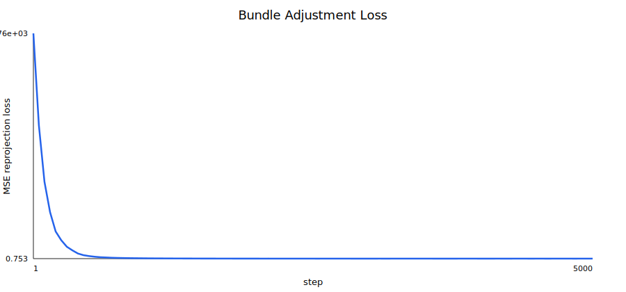
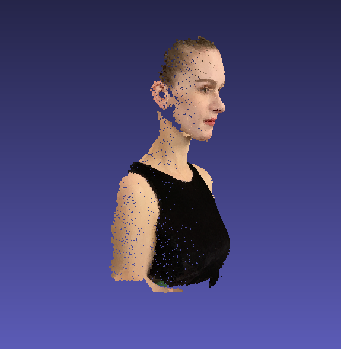
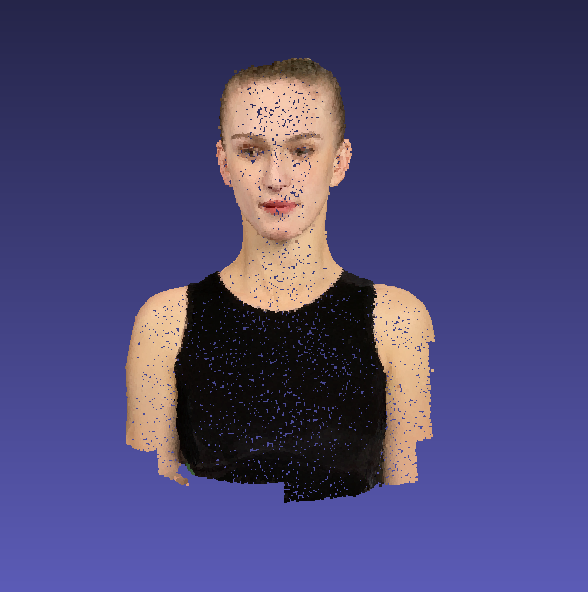
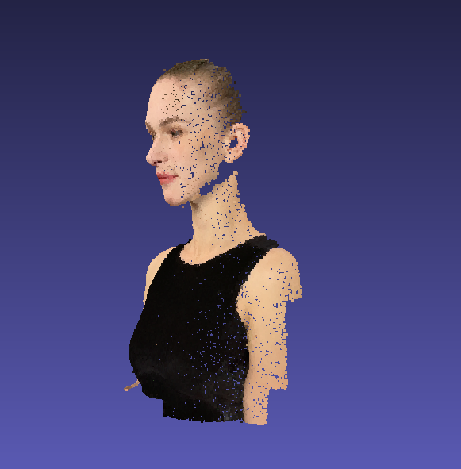
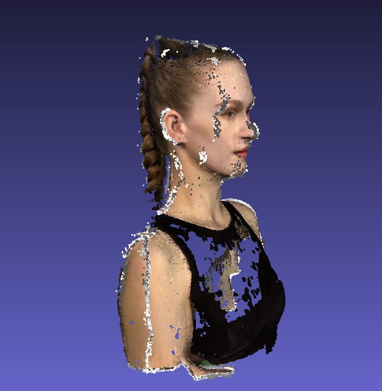
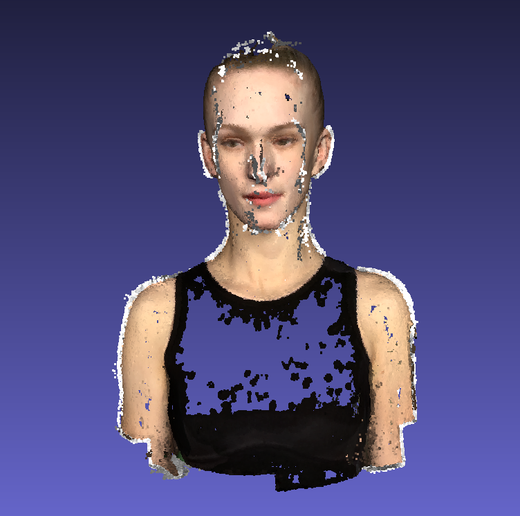
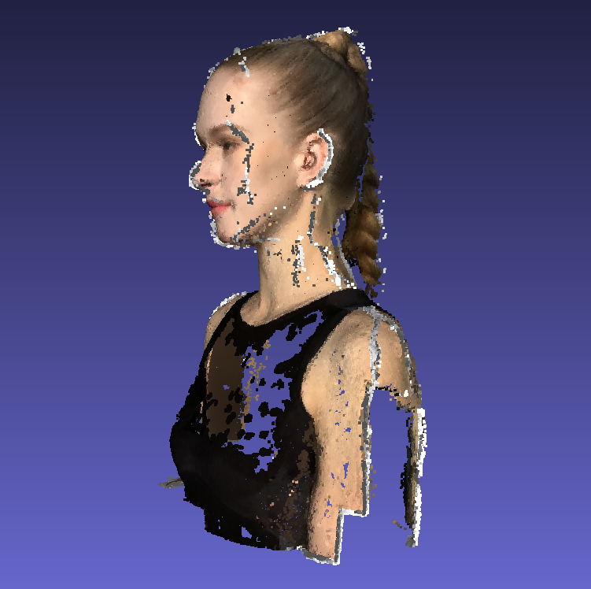

# Assignment 3 - Bundle Adjustment

## Task 1: PyTorch Bundle Adjustment

### 算法原理

Bundle Adjustment (BA) 是通过最小化重投影误差来同时优化场景几何结构（3D 点坐标）和相机参数（内参及外参）的过程。

#### 1. 投影模型

给定 3D 点 $\mathbf{P}_i = [X_i, Y_i, Z_i]^T$ 和第 $j$ 个相机的变换矩阵 $\mathbf{R}_j$ 与平移向量 $\mathbf{T}_j$，点在相机坐标系下的坐标为：
$$[X_{c}, Y_{c}, Z_{c}]^T = \mathbf{R}_j \mathbf{P}_i + \mathbf{T}_j$$

根据针孔相机模型，投影到 2D 像素平面的坐标 $(u, v)$ 为：
$$u = -f \frac{X_c}{Z_c} + c_x, \quad v = f \frac{Y_c}{Z_c} + c_y$$
其中 $f$ 为共享焦距，$(c_x, c_y)$ 为图像中心。由于 $Z_c < 0$，在 $u$ 分量上取负号以修正左右镜像。

#### 2. 参数化表示

- **旋转矩阵**：使用欧拉角 $(\alpha, \beta, \gamma)$ 进行参数化，通过 `euler_angles_to_matrix` 转换为旋转矩阵 $\mathbf{R}$。
- **优化变量**：包含全局共享焦距 $f$、每个相机的 Extrinsics（欧拉角与平移向量）以及所有 3D 点的坐标。

#### 3. 目标函数

优化目标为带可见角掩码的重投影误差平方和：
$$\min_{f, \{\mathbf{R}_j, \mathbf{T}_j\}, \{\mathbf{P}_i\}} \sum_{i, j} w_{ij} \| \pi(\mathbf{P}_i; f, \mathbf{R}_j, \mathbf{T}_j) - \mathbf{q}_{ij} \|^2$$
其中 $\mathbf{q}_{ij}$ 为观测到的 2D 坐标，$w_{ij} \in \{0, 1\}$ 表示该点在对应视角下的可见性。

### 代码实现

代码文件见 `bundle_adjustment.py`

### 实验结果

loss 曲线：



重建点云结果：

|  |  |  |
| --- | --- | --- |

## Task 2: COLMAP Reconstruction

使用 COLMAP 根据多视角图片进行三维重建。

### 运行方式

运行命令：

```bash
bash run_colmap.sh
```

流程包括：

1. Feature Extraction
2. Exhaustive Matching
3. Sparse Reconstruction
4. Image Undistortion
5. Patch Match Stereo
6. Stereo Fusion

### 实验结果

|  |  |  |
| --- | --- | --- |

## 结果对比

Task 1 使用 `points2d.npz` 中给定的跨视角点对应关系，优化结果较稳定，点云结构完整。

Task 2 只使用 RGB 图像进行特征匹配和稠密重建，COLMAP 的稠密结果中存在空洞和背景噪声点。
